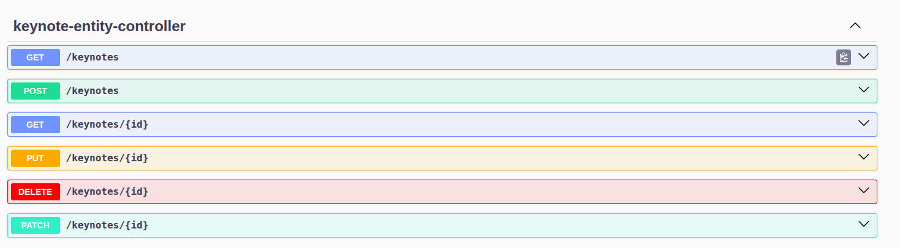
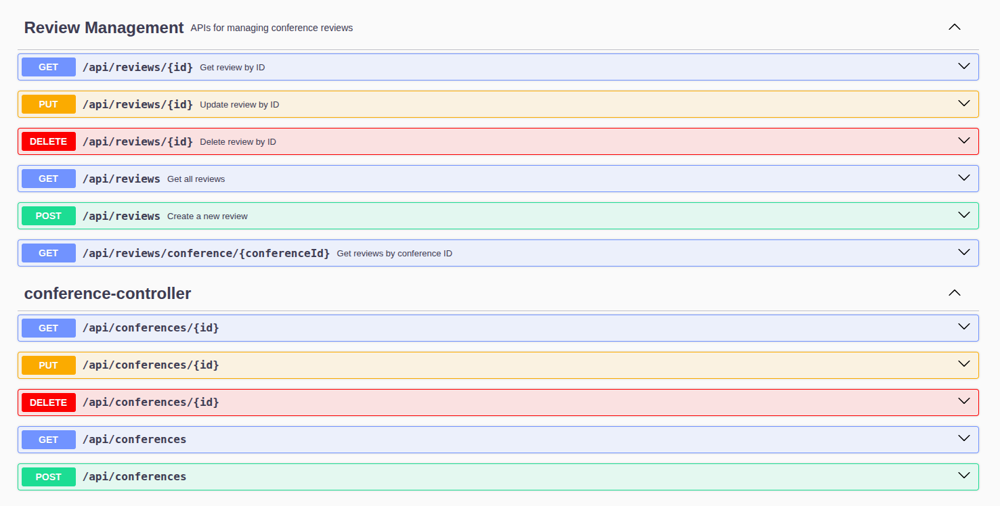

# Conference Management System

## Project Overview

This is a **Spring Cloud Microservices** project designed to manage conferences and keynote speakers. It demonstrates a modern distributed system architecture with multiple independent services communicating through REST APIs and service discovery.

The project uses:
- **Spring Boot 3.5.7** with Java 21
- **Spring Cloud 2025.0.0** for microservices infrastructure
- **Netflix Eureka** for service discovery
- **Spring Cloud Config Server** for centralized configuration
- **Spring Cloud Gateway** for API routing and load balancing
- **H2 Database** for in-memory data persistence
- **MapStruct** for entity-DTO mapping
- **Lombok** for boilerplate reduction
- **OpenAPI/Springdoc** for API documentation

---

## Architecture

This project follows a **microservices architecture** with the following components:

```
┌─────────────────────────────────────────────────────────┐
│         API Client / Frontend                            │
└────────────────────────┬────────────────────────────────┘
                         │
                         ▼
        ┌────────────────────────────────┐
        │   Gateway Service (Port 8888)  │
        │  (Spring Cloud Gateway)        │
        └────────────────┬───────────────┘
                         │
          ┌──────────────┼──────────────┐
          ▼              ▼              ▼
    ┌─────────────┐ ┌─────────────┐ ┌──────────────┐
    │ Keynote     │ │ Conference  │ │   Discovery  │
    │ Service     │ │ Service     │ │   Service    │
    │ (8080)      │ │ (8081)      │ │   (8761)     │
    │             │ │             │ │              │
    │ H2 DB       │ │ H2 DB       │ │ Eureka       │
    └─────────────┘ └─────────────┘ └──────────────┘
          ▲              │
          └──────┬───────┘
                 │
         ┌───────▼──────────┐
         │  Config Service  │
         │     (9999)       │
         │ Config Server    │
         └──────────────────┘
                 │
         ┌───────▼──────────┐
         │  Config Repo     │
         │  (Git-backed)    │
         └──────────────────┘
```

---

## Microservices

### 1. **Discovery Service** (Eureka Server)
- **Port**: 8761
- **Purpose**: Service registry and discovery
- **Technology**: Netflix Eureka Server
- **Responsibilities**:
  - Maintains registry of all available services
  - Provides service discovery for inter-service communication
  - Enables client-side load balancing


---

### 2. **Config Service** (Spring Cloud Config Server)
- **Port**: 9999
- **Purpose**: Centralized configuration management
- **Technology**: Spring Cloud Config Server
- **Data Source**: Git-based configuration repository
- **Config Repository Location**: `/config-repo`


**Managed Configurations**:
- `application.properties`: Global configuration for all services
- `conference-service.properties`: Conference service-specific config
- `keynote-service.properties`: Keynote service-specific config

---

### 3. **Gateway Service** (Spring Cloud Gateway)
- **Port**: 8888
- **Purpose**: API Gateway and reverse proxy
- **Technology**: Spring Cloud Gateway
- **Features**:
  - Dynamic route discovery via Eureka
  - Single entry point for all client requests
  - Service-to-service communication routing


---

### 4. **Keynote Service** (Business Service)
- **Port**: 8080
- **Purpose**: Manage keynote speakers for conferences
- **Database**: H2 in-memory database
- **Technology Stack**:
  - Spring Data JPA
  - Spring Web
  - MapStruct for DTO mapping
  - SpringDoc OpenAPI for Swagger UI


#### REST Endpoints:
| Method | Endpoint | Description |
|--------|----------|-------------|
| POST | `/keynotes` | Create a new keynote speaker |
| GET | `/keynotes` | Get all keynote speakers |
| GET | `/keynotes/{id}` | Get keynote speaker by ID |
| PUT | `/keynotes/{id}` | Update keynote speaker |
| DELETE | `/keynotes/{id}` | Delete keynote speaker |

---

### 5. **Conference Service** (Business Service)
- **Port**: 8081
- **Purpose**: Manage conferences and reviews
- **Database**: H2 in-memory database
- **Key Features**:
  - Inter-service communication with Keynote Service via OpenFeign
  - Review management for conferences
  - Type classification (ACADEMIC or COMMERCIAL)


#### REST Endpoints:
| Method | Endpoint | Description |
|--------|----------|-------------|
| POST | `/api/conferences` | Create a new conference |
| GET | `/api/conferences` | Get all conferences |
| GET | `/api/conferences/{id}` | Get conference by ID |
| PUT | `/api/conferences/{id}` | Update conference |
| DELETE | `/api/conferences/{id}` | Delete conference |

#### Inter-Service Communication:
Conference Service uses **OpenFeign** client to call Keynote Service:


## Configuration Files

### Global Configuration (`config-repo/application.properties`)
```properties
# H2 Console
spring.h2.console.enabled=true

# Cloud Discovery & Config
spring.cloud.discovery.enabled=true
spring.cloud.config.enabled=true

# Eureka Discovery
eureka.client.service-url.defaultZone=http://localhost:8761/eureka/
eureka.instance.prefer-ip-address=true

# Management Endpoints
management.endpoints.web.exposure.include=*
```

### Conference Service Config (`config-repo/conference-service.properties`)
```properties
# Database configuration
spring.jpa.properties.hibernate.dialect=org.hibernate.dialect.H2Dialect
spring.datasource.url=jdbc:h2:mem:conference-db
spring.datasource.driverClassName=org.h2.Driver
```

### Keynote Service Config (`config-repo/keynote-service.properties`)
```properties
spring.h2.console.enabled=true
spring.datasource.url=jdbc:h2:mem:keynotedb
spring.datasource.driverClassName=org.h2.Driver
```

---

---

## Getting Started

### Prerequisites
- Java 21
- Maven 3.6+
- Git

### Build

```bash
# Build all services
mvn clean install

```

### Run All Services (Recommended Order)

1. **Start Discovery Service** (Eureka Server)
```bash
cd discovery-service
mvn spring-boot:run
# Access Eureka Dashboard: http://localhost:8761
```

2. **Start Config Service** (Config Server)
```bash
cd config-service
mvn spring-boot:run
# Config Server ready at: http://localhost:9999
```

3. **Start Keynote Service**
```bash
cd keynote-service
mvn spring-boot:run
# Service running at: http://localhost:8080
# Swagger UI: http://localhost:8080/swagger-ui.html
```

4. **Start Conference Service**
```bash
cd conference-service
mvn spring-boot:run
# Service running at: http://localhost:8081
# Swagger UI: http://localhost:8081/swagger-ui.html
```

5. **Start Gateway Service**
```bash
cd gateway-service
mvn spring-boot:run
# Gateway running at: http://localhost:8888
```

---

## Accessing the Swagger UIs
- **Keynote Service Swagger UI**: [http://localhost:8080/swagger-ui.html](http://localhost:8080/swagger-ui.html)

- **Conference Service Swagger UI**: [http://localhost:8081/swagger-ui.html](http://localhost:8081/swagger-ui.html)
